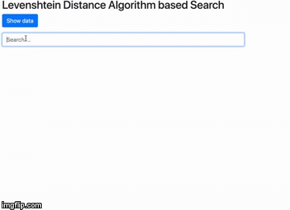

# levenshtein_distance_search
<h3>This project build in using</h3>
<ul>
    <li>1. HTML</li>
    <li>2. CSS</li>
    <li>3. Vue.js</li>
    <li>4. Levenshtein Distance Algorithm</li>
</ul>

 

<a href="https://en.wikipedia.org/wiki/Levenshtein_distance">What is Levenshtein Distance Algorithm?</a>

